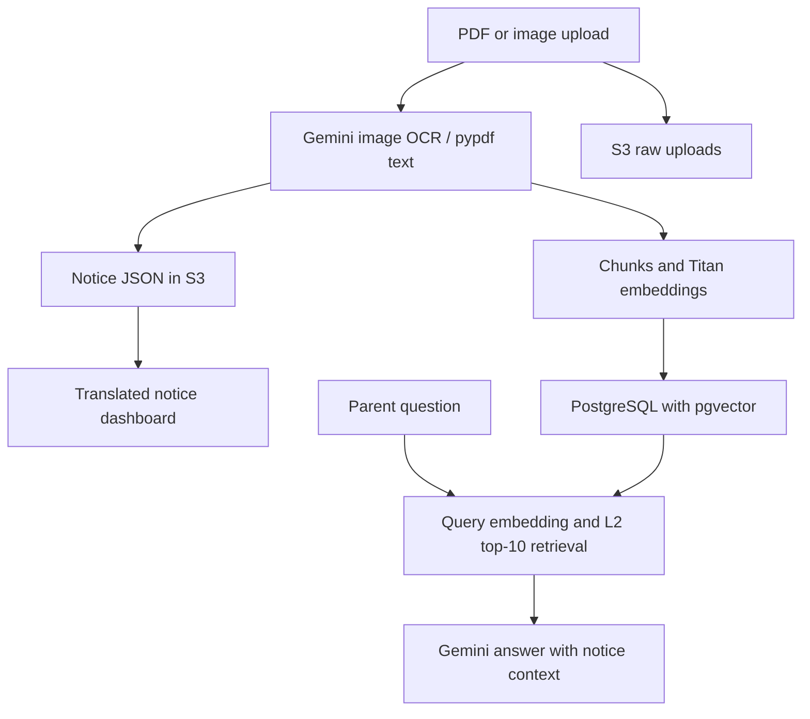

# School Buddy

**A team hackathon prototype for reading Korean school notices and asking follow-up questions.** It helps multicultural families move from unfamiliar school terms to understandable information and next steps.

**[Representative OCR + RAG code](https://github.com/JAEUK02/schoolbuddy/blob/model_optimization/test_jaeuk.py) · [My contribution commit](https://github.com/JAEUK02/schoolbuddy/commit/ab3f202c9e1f62416e17991163bf95d8fd2b82e3) · [Code and branch map](docs/code-map.md)**

The integrated experiment combines image OCR, PDF text extraction, multilingual notice summaries, and document-context Q&A. The default branch holds the earlier Nova Lite FAQ app; start with `test_jaeuk.py` on the **`model_optimization` branch** to inspect the fuller workflow.

## Problem and approach

School notices mix unfamiliar educational terms with dates, documents, and actions. Translating a term alone may not explain what a parent needs to do.

The initial FAQ prototype uses a three-step explanation prompt: **what it means → why it matters → what the parent should do**. The integrated experiment adds uploaded notices, readable summaries, and retrieved document context for follow-up questions.

## My contribution and team context

This Hanyang AWS Bootcamp project is a public fork of the team's [xianiax02/schoolbuddy](https://github.com/xianiax02/schoolbuddy). My recorded contribution, [commit `ab3f202`](https://github.com/JAEUK02/schoolbuddy/commit/ab3f202c9e1f62416e17991163bf95d8fd2b82e3), adds the integrated `test_jaeuk.py` experiment to this fork.

That commit records the original hackathon snapshot. The current `model_optimization` branch also includes the reliability improvements below; the fixed historical links in the code map remain available for contribution review.

That file connects upload, analysis, dashboard, translation, retrieval, chat, and program-listing flows in one Streamlit entry point. Shared team variants and their contributor histories are linked in the [code map](docs/code-map.md#contribution-and-provenance).

## Reliability improvements

[Merged PR #1](https://github.com/JAEUK02/schoolbuddy/pull/1) adds four-language empty states, notice JSON validation and translation fallback, separate raw/summary/indexing results, and DB rollback/resource cleanup. The current entry point reports indexing success only after commit and removes the revoked embedded credential fallback.

**[Current setup and limits](https://github.com/JAEUK02/schoolbuddy/blob/model_optimization/docs/notice-development.md) · [Offline regression tests](https://github.com/JAEUK02/schoolbuddy/tree/model_optimization/tests)**

Verification: **23 offline tests and 40 subtests passed**, with network-blocked mocks. The [successful PR CI run](https://github.com/JAEUK02/schoolbuddy/actions/runs/36954722132) tested the reliability change; the exact merged tree was also checked locally. The merged implementation has not been deployed, and live end-to-end operation remains unverified. Model IDs, AWS region, S3 prefixes, chunk boundaries, and L2 top-10 retrieval are unchanged.

## Implementation flow

| Stage | Representative implementation |
| --- | --- |
| Read a notice | Gemini 2.5 Flash reads JPEG/PNG images; `pypdf` extracts PDF text. |
| Store and summarize | Raw uploads and Gemini-generated notice JSON are stored in S3. |
| Translate | Korean, English, Vietnamese, and Chinese choices; on-demand JSON translation with a 3,600-second cache. |
| Retrieve | Overlapping text chunks, Titan embeddings, and PostgreSQL/pgvector L2 search for the nearest 10 chunks. |
| Answer and explore | Gemini receives retrieved notice context and the selected language; a separate view lists Danuri programs. |



## Where to look

| Review goal | Entry point |
| --- | --- |
| Integrated OCR + RAG experiment | [`test_jaeuk.py` on `model_optimization`](https://github.com/JAEUK02/schoolbuddy/blob/model_optimization/test_jaeuk.py) |
| Initial FAQ and streaming prompt | [`app.py` on `main`](app.py) |
| Six branches, team variants, and line-level implementation links | [Code and experiment map](docs/code-map.md) |

## Offline review without service credentials

Use a separate checkout of the representative branch to inspect and test the notice helpers before running a service-backed app:

```bash
git clone --branch model_optimization https://github.com/JAEUK02/schoolbuddy.git schoolbuddy-offline-review
cd schoolbuddy-offline-review
python3 -m venv .venv
source .venv/bin/activate
python -m pip install -r requirements-dev.txt
python -m pytest -q
```

These tests inject service mocks and block socket connections; they do not import the executable app or load `.env`. The [current setup/test guide](https://github.com/JAEUK02/schoolbuddy/blob/model_optimization/docs/notice-development.md#offline-regression-suite) explains discovery and the separate requirements for live execution.

## Local exploration

The initial FAQ app uses Nova Lite in `us-east-1`. With an existing AWS credential profile or another boto3-supported credential provider and permission to invoke that model:

```bash
git clone --branch main https://github.com/JAEUK02/schoolbuddy.git
cd schoolbuddy
python3 -m venv .venv
source .venv/bin/activate
python -m pip install -r requirements.txt
streamlit run app.py
```

The local page normally opens at `http://localhost:8501`. Bedrock requests incur usage costs.

The integrated experiment uses a different branch, dependencies, and external resources. See [reproduction requirements](docs/code-map.md#reproduction-boundaries) before running `streamlit run test_jaeuk.py` on `model_optimization`.

## Status and limits

- This is an educational team prototype. A maintained production deployment, measured user impact, and evaluated accuracy/latency improvements are not established here.
- Four language choices and content translation are implemented; some interface strings remain untranslated.
- Q&A supplies retrieved context but does not enforce source citations or refusal without relevant context. Outputs require validation.

PDF limitations, incomplete setup, experiment differences, and future ideas are documented in the [code map](docs/code-map.md#reproduction-boundaries).

## 📄 라이선스

이 프로젝트는 교육 및 연구 목적으로 제공됩니다.
